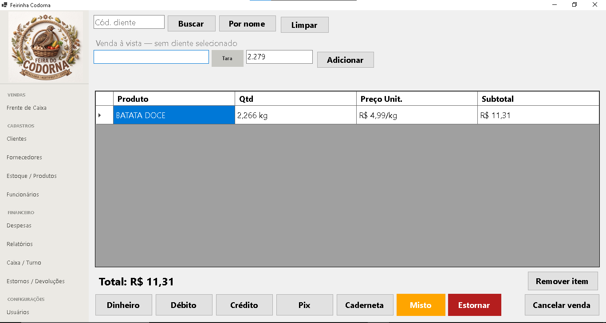

# Feirinha do Codorna 🥬

Sistema de gestão comercial desktop desenvolvido para auxiliar no controle de vendas, estoque, clientes e fornecedores.

---

## 📸 A Equipe e o Projeto
Aqui estou eu, na prática, fazendo o sistema acontecer no dia a dia da feirinha!

  

## 🚀 Sobre o Projeto
O Feirinha Codorna foi desenvolvido para facilitar a gestão de pequenas mercearias e feiras livres. O foco é oferecer uma ferramenta simples, rápida e eficiente, garantindo que o pequeno comerciante tenha controle total sobre suas movimentações diárias, sem depender de internet ou sistemas complexos.

## 🛠 Tecnologias Utilizadas
- **Linguagem:** C# (.NET)
- **Banco de Dados:** SQLite
- **Interface:** Windows Forms
- **Controle de Versão:** Git/GitHub

## 📋 Funcionalidades Principais
- **Gestão de Produtos:** Controle de estoque com entrada, saída e estoque mínimo.
- **Controle de Vendas:** Registro de vendas com baixa automática de estoque.
- **Caderneta (Fiado):** Controle de saldo devedor e limite de crédito para clientes.
- **Controle Financeiro:** Gerenciamento de despesas e movimentação de caixa.
- **Segurança:** Sistema de login com criptografia.

## 🖼️ Galeria de Imagens

| Tela de Vendas | Tela de Pagamento |
| :---: | :---: |
|  |  |

## ⚙️ Como rodar o projeto
1. Clone este repositório: `git clone https://github.com/Edinaldo-long/FeirinhaCodorna.git`
2. Abra o arquivo `FeirinhaCodorna.sln` no Visual Studio.
3. Certifique-se de ter o .NET instalado.
4. Clique em "Iniciar" (ou pressione F5).

---
*Desenvolvido para a Feirinha do Codorna.*
